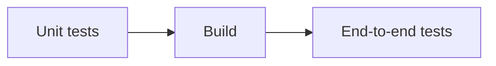
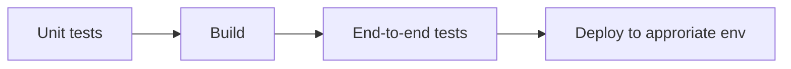

# DL/SN Practical Exercise

## Premise
A start-up with a web application including some functionality which retrieves data from various HTTP endpoints, enriched with data from a PostgreSQL database.

User requests are received by a frontend application built with the Django framework.

Performing the HTTP requests and retrieving data from the database is handled by separate backend agent processes.

Communication between the frontend and backend is mediated through RabbitMQ queues.

> If the expectation is for the backend task to be completed within the lifetime of a single request, it might be worth investigating a refactor to use modern async capabilities in Python/Django to handle these tasks in the frontend, and remove the complexity of RabbitMQ and the worker model.

Each service is containerised.

Only the frontend service is exposed to the public Internet.

For the purposes of this exercise, I've chosen to name the overall service **fred**.

## Objectives
1. State the resources and tooling you would use to deploy the above stack.
2. State the services you would deploy and use to monitor and address performance issues and bugs that might occur with the stack.
3. Indicate in terms of tooling or services, ways in which you would enable testing and deployment of code improvements and bugfixes.
4. Deliver a directory structure containing code/pseudocode utilising Terraform and any other tooling chosen for the solution.

## Solutions
I imagine two scenarios I might find myself in for this task. They are both extremes to some extent, and there are plenty of alternatives in the middle.

In both cases I've chosen AWS as the "mainstream" provider because it's what I know best, and with all other things being equal, leaning into your people's existing experience is at least a reasonable starting position.

### Scenario 1: The lean startup
In this case, the startup is running lean that requires a simple but robust solution for operating *fred*, which itself comprises the majority of their product offering.

#### AWS
My first instinct is to look at AWS to obtain potentially low maintenance complexity by utilising their managed services. This might look like:
* Amazon MQ for RabbitMQ
	* A high-availability deployment (3 node cluster) - starts at 700 USD per month (!!)
	* A single instance deployment allows for a smaller instance size - 32 USD per month
	* Both with 100Gb of usable storage
* ELB - Application Load Balancer
	* 1Tb per month, 1 request/sec - 27 USD per month
* Elastic Container Service with Fargate
	* 4 x 1 CPU, 2Gb, 20Gb ephemeral storage - 144 USD per month
	* Assuming 2 instances of the frontend app, and 2 instances for the backend
* RDS for PostgreSQL
	* Multi-AZ (good, but not instant failover) t4g.small with 2 CPU, 2Gb RAM, 100Gb storage, 250Gb backups - 141 USD per month
* Cloudwatch Metrics and Logs
	* Assuming 30 detailed/custom metrics, plus database insights for RDS and 20Gb/month of logs - 47 USD per month

Nearly $1,100 per month is pretty steep! Admittedly, just over $390 if we forgo HA for RabbitMQ and can fit within it's constraints.

These resources could be provisioned entirely with Terraform. We're responsible for keeping our code aligned with available versions of the managed services, keeping our container images up-to-date and secure, and for keeping an eye on resource usage. For the most part, we're leaving the rest up to AWS.

#### Hetzner
If we're especially cost sensitive and have sufficient free time to do the extra setup and maintenance legwork, a lower cost provider such as Hetzner or Digital Ocean could save us some money.

Terraform providers are available for these platforms to perform the basic networking, instance and load balancer configurations. But we'll need to go further to provision our workloads on top of this infrastructure, with a tool like Ansible perhaps.

Chargeable resources are:
* 9 x 2 dedicated CPU, 8GB RAM, 80Gb storage - 127 USD per month
	* 3 x for Rabbit MQ cluster
	* 2 x for PostgreSQL with failover
	* 2 x for frontend
	* 2 x for backend
* 500Gb block storage - 25 USD per month (optional)
	* 3 x 100Gb for Rabbit MQ
	* 2 x 100Gb for PostgreSQL
* 1Tb Object Storage for backups (minimum price) - 6 USD per month
* 1 x 4 shared CPU, 8GB RAM, 160Gb storage - 16 USD per month
	* Providing Prometheus and Grafana, including alerting
* 1 x LB11 Load balancer with 20Tb transfer - 6 USD per month

A total of $180 per month for considerably more compute resources than the AWS version specced above, but with a higher engineering cost upfront and ongoing, as we're responsible for all OS and service upgrades, dealing with failed instances, etc and maintaining our Ansible runbooks.

### Scenario 2 - The well funded startup with aspirations
In this case, we're focused on future growth, both in the scale of our customer base and compute requirements, but also in our products. We may be expecting to support an increasing number of services over time, and to reach a point where we want to take advantage of dynamic scaling to respond to demand that may vary considerably. We don't want to just burn money unnecessarily!

We want to lay a solid foundation for this future, whilst also minimising cloud vendor lock-in to ensure we remain flexible. If we're not sensitive to lock-in, we might leverage more of the proprietary services offered by our cloud vendor than the solution presented here.

My example code in this repo is focused on delivering this scenario. This example is based on AWS, but could easily apply to other providers with similar capabilities.

#### Terraform structure
There are pros and cons of maintaining a monolithic Terraform state for all our infrastructure. It provides a consistent single source of truth, so that we can know a single `terraform apply` will bring our entire environment in line with the current code. It also increases the blast radius for each apply operation, and demands that near maximum privileges be granted to the user or job executing the change.

For this scenario I've decided to split the project into three separate but related Terraform project:
* `common` defines our underlying resources which may be shared among multiple projects and clusters, and rarely changes.
* `prodcluster` defines our production Kubernetes cluster and the common supporting services deployed to it. The infrastructure team is responsible for maintaining this.
* `fred` defines resources that are specific to our application, and this may be maintained by the developer team in collaboration with the infrastructure team. This project may live in the infrastructure repo, or each app may keep it alongside the code in it's own repo.

Each project builds on the previous, where `prodcluster` uses resources defined in common, and `fred` uses resources defined in `prodcluster`.

The projects as presented here may use some third party modules, but each is otherwise self contained. In the real world, we would likely identify commonalities between our applications, and potentially have need for more than one cluster or deployment of our app.

In that situation, I would typically create modules for these, and our `prodcluster` and `fred` projects would consume these and effectively be minimal stubs of configuration specific to that particular deployment.

#### AWS resource overview
The solution is composed of the following high-level Terraform provisioned AWS resources:
* An S3 bucket - for Terraform state storage
* A VPC (network) composed of multiple subnets for the purposes of being distributed across multiple availability zones for improved availability and separation of public and private endpoints, with NAT gateways to provide outbound Internet access to private resources
* An EKS (Elastic Kubernetes Service) cluster providing the fabric on which we will deploy our applications
* A set of small "core" EC2 instances in a managed node group that run the most essential cluster services (DNS, Karpenter)
* IAM roles suitable for each component

In addition to the Terraform provisioned resources, Kubernetes (or component therein) will be responsible for provisioning:
* Additional EC2 instances where our main workloads will be scheduled, dynamically managed by the Karpenter auto-scaler - the number and size of these instances is determined by the workloads we deploy
* Application Load Balancer - provisioned in response to Ingress and Service resources
* EBS volumes - provisioned in response to PersistentVolume resources

#### Kubernetes resource overview

##### Supporting services
For this solution, I've chosen to deploy PostgreSQL, RabbitMQ, Prometheus and Grafana within Kubernetes to reduce cloud costs and for maximum flexibility. A more thorough investigation would be advisable to understand the cloud cost vs engineering cost difference of this approach versus using AWS managed services, along with identifying risks with upstream providers of these Helm charts.

Deployed to the Kubernetes cluster are:
* [Karpenter](https://karpenter.sh/) - an operator for "just-in-time nodes for any Kubernetes cluster"
* [AWS Load Balancer Controller](https://kubernetes-sigs.github.io/aws-load-balancer-controller/latest/) - for managing the lifecycle of Ingress and Service (type: Loadbalancer) resources
* [EBS-CSI](https://github.com/kubernetes-sigs/aws-ebs-csi-driver) - for managing the lifecycle of Persistent Volume resources
* [External DNS](https://github.com/kubernetes-sigs/external-dns) - an operator for managing an external DNS service to populate and maintain entries based on resources in Kubernetes
* [External Secrets](https://github.com/external-secrets/external-secrets) - an operator for populating Secrets in Kubernetes from Cloud Provider secrets management services
* [Prometheus](https://prometheus.io/), including the Prometheus Node Exporter - for collecting metrics from many components of the cluster and from our applications - also providing the tools needed for alerting
* [Grafana](https://grafana.com/oss/grafana/), for providing dashboards built on the collected metrics in Prometheus
* [CloudNativePG](https://github.com/cloudnative-pg/cloudnative-pg) - an operator for managing the lifecycle of PostgreSQL database clusters
* [Loki](https://grafana.com/oss/loki/) - for aggregating logs from pods and host instances which can be explored in Grafana
* [Actions Runner Controller](https://github.com/actions/actions-runner-controller) - an operator for orchestrating GitHub Actions Runners inside the cluster - removing the need to expose our Kubernetes API endpoint to public runners, and being able to utilise a Service Account in the cluster for actions

I've not provided code for all of the above, and have chosen to use Terraform to deploy these tools with Helm charts. An alternative would be to utilise a GitOps approach with ArgoCD or Flux.

As part of the `prodcluster` Terraform I also create the `prodfred` namespace for our app - we'll keep all of our fred-related resources in a single namespace, our *fred* Terraform user/job will only need privileges for this namespace.

##### Fred
I have captured the resources for *fred* together in a Helm chart, which will be applied to the cluster with Terraform. It is composed of the following resources:
* `frontend` service - corresponding to pods running our frontend Django app
* `frontend` ingress - for exposing our frontend service to the public internet
* `frontend` deployment - defining our frontend pods, and allowing for rolling upgrades
* `freddb` PostgreSQL Cluster - defining our database cluster (acted upon by the CloudNativePG operator)
* `backend` deployment - defining our backend agent pods, and allowing for rolling upgrades

Not included in the code, but recommended are PodDisruptionPolicies, HorizontalPodAutoscaler and NetworkPolicy resources.

In addition to the *fred* Helm chart, the Terraform also manages a deployment of the [Bitnami RabbitMQ chart](https://artifacthub.io/packages/helm/bitnami/rabbitmq) to provide clustered Rabbit MQ within the namespace.

The Rabbit MQ chart, and the PostgreSQL cluster resource will result in the creation of many additional resources in the namespace for operating these services, including secrets and persistent volumes.

I have not shown how the backend pods consume connection details and credentials for the Rabbit MQ cluster or the Postgres database cluster.

I have also not addressed backups, which in this kind of environment can be implemented with a tool like [Velero](https://velero.io/) which can create snapshots of Kubernetes state, stored to S3, and manage EBS volume snapshots.

#### Performance monitoring and catching bugs
The majority components in the stack either directly serve Prometheus metrics, or can be connected to an exporter agent that provides Prometheus metrics. We should instrument *fred* to also produce relevant metrics.

We can use these metrics for a variety of purposes:
* For dashboards in Grafana that give us an overview of our service health and performance, many of which are publicly available and easily leveraged. Such visualisations can make it easier to spot changes in response times, increased disk IO, etc ahead of failures
* For creating alerts for when conditions are outside of our expected operating range (e.g. low disk space, high response times, long queues, OOM events)
* As a source of custom metrics for the Kubernetes auto-scaling tools, allowing for example for us to dynamically scale the number of backend pods according to Rabbit MQ queue length

I would also recommend an external service to provide a basic availability check for our system, so we're not solely reliant on a component within the infrastructure to alert us to catastrophic issues.

Finally, a service like [Sentry](https://sentry.io/welcome/) could be used, either as an external provider or self-hosted, and integrated into our application to give greater insight into performance, and more detailed debug information in the event of exceptions in the code.

#### CI
Before *fred* even touches our Git remote, developers should be able to easily write and execute unit tests on their own machines.

It would also be beneficial to create end-to-end tests that can validate the complete behaviour of the system. In an ideal world, it would be possible to also execute these quickly and locally. A tool like Podman or Docker makes this reasonably straightforward, allowing us to run all the supporting components locally.

We would also like to run these same tests as part of our collaborative development workflow, allowing us to build out a Continuous Integration pipeline.

The first step is our pre-merge pipeline, run on pull requests, and required to pass before they can merge.

Executing our end-to-end tests in CI could be performed in a few ways.
* The simplest, assuming the capability execute a container runtime *within* a CI job, might be to use the same tooling a developer uses.
* For a closer-to-production test, we might provision a short-lived Kubernetes namespace and deploy the pull request to it, run our tests against it, and then remove the namespace and resources within it.

#### Deployment
Once merged, the next step depends on our organisational needs. We might prefer to create versioned releases on a certain cadence, or according to milestones, and our Git branching and tagging strategy will reflect this.

In that case, we might also chose to maintain live environments of our latest main branch and/or pre-release branches for additional validation. For that we could run a post-merge CI pipeline in those branches to again perform our tests and then this time to deploy to the relevant environment.

For this kind of workflow we could turn our application Terraform project into a module, and re-use it to manage the lifecycle of these different deployments of our app, either into the same cluster, or into a separate dedicated cluster. In either case, each deployment is contained within it's own namespace and dynamically configured based on the branch.

An additional and optional manually trigger job at the end of the pipeline could be used to remove the branched deployment from the cluster when it is no longer required.

Deploying to production in this scenario would be very similar to deploying to a branch-specific environment. A long lived and protected production branch would be maintained, and once changes are merged here, they are deployed to the production environment. The job to remove the deployment would not be included for this branch.

Alternatively, if we are confident in the quality of our processes and our testing and monitoring systems, we may chose to deploy every merge to main to our production environment.

In all cases, Kubernetes health checks give us additional confidence that certain classes of failure will halt the rollout process.

As we mature, we can investigate performing "canary" deployments with tooling like Istio and Flagger, which allow a gradual rollout of new versions with checks in place around key metrics, like error rates and response times, and automatic rollback in the event of detected issues. Though this is subject to compatibility in our application, for example database migrations would be need be backward compatible to the previous version to safely allow rollbacks.

